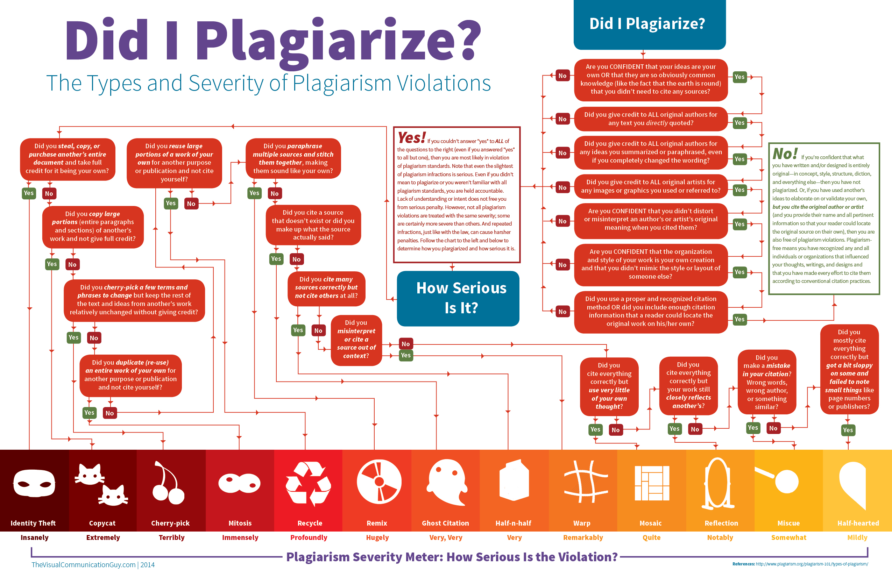

# Locality sensitive hashing
> Application of finding plagiarized documents.

In computer science, locality-sensitive hashing (LSH) is an algorithmic technique that hashes similar input items into the same "buckets" with high probability. (The number of buckets are much smaller than the universe of possible input items.) Since similar items end up in the same buckets, this technique can be used for data clustering and nearest neighbor search. It differs from conventional hashing techniques in that hash collisions are maximized, not minimized. Alternatively, the technique can be seen as a way to reduce the dimensionality of high-dimensional data; high-dimensional input items can be reduced to low-dimensional versions while preserving relative distances between items.

# Turnitin sample

## Problem statement
In this project, we have studied Locality Sensitive Hashing with an application of finding plagiarized documents. We have used Shingling, Min-Hashing, and LSH to identify similar (plagiarized) documents.

## Implementation details
* Shingling - Count total number of unique shingles in the data sample, create 4-shingle index
* Min-Hashing - Hash function generation, Signature matrix generation, fact check
* LSH - Hashing, fact check

## Input

The input data  corpus  was  a  part  of  the  research  study  that  created  ground  truth  dataset  for plagiarism detection algorithms1. The data corpus is made of short answers (200-300 words) to  5  basic  Computer  Science  questions.  The  corpus  contains  100  answers/documents-95 documents (file  names  prefixed  with  ‘g’) represent  answers  given  by  19  students  for  all  5 questions,  and  5  documents (file names prefixed with ‘orig’) collected  directly  from  Wikipedia articles. 

The corpus has been designed to represent varying degree of plagiarism: 
* 1.Cut: Answers were directly copied from Wikipedia
* 2.Light revision:Copied with little alterations on words and phrases
* 3.Heavy revision:Each sentence isrephrased heavily intosentenceswith similar meaning
* 4.Non-plagiarism: Participants read  Wikipedia  articles  and  write  answers  based  on  their understandingWe will use original datasets (original Wikipedia articles) to query nearly matching documents to find  plagiarized  student  answers.  The  answers-to-plagiarism_degree  mapping  is  given  in  the corpus-final09.xls for the reference. 

## Output

Top 5 plagiarized documents from the corpus

## Application of LSH

LSH has been applied to several problem domains, including:

* Near-duplicate detection
* Hierarchical clustering
* Genome-wide association study
* Image similarity identification
* Gene expression similarity identification
* Audio similarity identification
* Nearest neighbor search
* Audio fingerprint
* Digital video fingerprinting
* Physical data organization in database management systems
* Training fully connected neural networks
* Computer security

## More info

*credits: thevisualcommunicationguy*

## Release History

* 0.1.1
    * CHANGE: Update docs (module code remains unchanged)
* 0.1.0
    * The first proper release
* 0.0.1
    * Work in progress

## Meta

Author: [Prasad Hajare](https://www.itsprasad.com/), MS Computer Science.

Distributed under the [MIT License](LICENSE).

<!-- Markdown link & img dfn's -->
[npm-image]: https://img.shields.io/npm/v/datadog-metrics.svg?style=flat-square
[npm-url]: https://npmjs.org/package/datadog-metrics
[npm-downloads]: https://img.shields.io/npm/dm/datadog-metrics.svg?style=flat-square
[travis-image]: https://img.shields.io/travis/dbader/node-datadog-metrics/master.svg?style=flat-square
[travis-url]: https://travis-ci.org/dbader/node-datadog-metrics
[wiki]: https://github.com/yourname/yourproject/wiki
